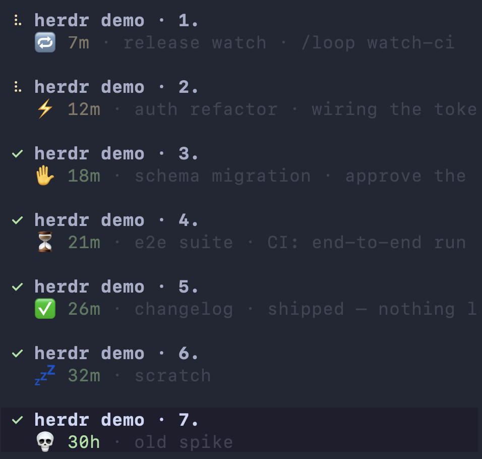

# herdr_status_plugin

Per-pane activity status for [herdr](https://herdr.dev) agent panes — shows, in the sidebar,
what each agent pane is doing (icon) and for how long (a live timer), plus a helper to rename
the current pane.



## Parts

- **`bin/herdr-status`** — the system command + a singleton daemon (the implementation lives in
  `lib/herdr-status.py`). Agents self-report intent (`working` ⚡ / `looping` 🔁 / `waiting` ⏳ /
  `input` ✋ / `done` ✅, plus `clear` / `off`); the daemon advances the counting timer and
  registers/prunes panes. An idle pane shows 💤 by default (herdr reports the idle state).
- **`herdr-plugin.toml`** — the herdr plugin manifest (`ot.claude-status`), at the repo root. Its `[[events]]` hooks
  on `pane.agent_detected` / `pane.agent_status_changed` run `herdr-status __run event`, so herdr
  captures the lifecycle events natively and pushes an immediate update on every transition.
- **`bin/herdr-status-rename`** — rename the current pane (sets both the pane label and the sidebar
  display name). `herdr-status-rename <name>` or `herdr-status-rename --clear`.

## Multiple herdr sessions

Each `herdr --session <name>` is an isolated server with its **own** config (plugins), socket, and
panes — so the plugin is **per-session**, not global. The default session is set up by `install.sh`;
for any other session, run **`herdr-status link`** from a pane inside it to register the plugin and
start that session's daemon. State and daemons are namespaced per server under
`~/.config/herdr/claude-status/<session>/`, so concurrent sessions never collide.

- **`herdr-status agents`** (alias `ls`) — list every agent pane across **all** herdr sessions,
  sorted by time-since (longest first). Columns: SESSION, PANE, NAME (the herdr **sidebar** name —
  `display_agent`, i.e. what `herdr-status-rename` sets; the detected agent when unnamed), STATE,
  and the live STATUS label (`💤 22h`, `⚡ 6m · <detail>`). Works from any terminal, in or out of herdr.

## Display model

Everything is reported as pane **metadata tokens** (herdr ≥ 0.7.4), which the sidebar renders
wherever the agent row layout references them:

- `$statusIcon` — icon for the pane's current state: ⚡ working, 🔁 looping, 💤 idle,
  ✅/⏳/✋ on a self-report, and 💀 once a pane goes stale (24h+).
- `$timeSinceLastAction` — counting timer since the last lifecycle transition (`6m`, `1h12m`, `36h`).
- `$custom_status` — the self-reported detail text, if any.

Add them to the agent rows in `~/.config/herdr/config.toml`:

```toml
[ui.sidebar.agents]
rows = [["$statusIcon", "agent", "$timeSinceLastAction"], ["$custom_status"]]
```

A working pane then reads `⚡ 6m fixing the parser`, an idle one just `💤 6m`.

## Install

```sh
herdr plugin install ondratuma/herdr-status-plugin
```

This clones the repo and registers the plugin. The event hooks run `bin/herdr-status` via the
manifest's **relative** command path (herdr runs plugin commands with the plugin directory as their
working directory), so nothing is machine-specific and there's no path to render.

The helper CLIs (`herdr-status`, `herdr-status-rename`) are symlinked into `~/.local/bin` by the
event hook itself, the first time an agent is detected in a pane — not by a build step. (A build
step runs in herdr's temporary checkout, which herdr then moves to its managed location, so any
symlink it created would dangle; the event hook runs from the stable installed root instead.)
Make sure `~/.local/bin` is on your `PATH`.

### Local development

When hacking on the plugin, link the working tree instead — build steps don't run on
`plugin link`, so use `install.sh` to do the same PATH-symlink step:

```sh
./install.sh    # symlinks the CLIs onto PATH + `herdr plugin link` this repo
```

Idempotent; re-run after pulling changes. The link step needs a running herdr server (run it from
inside herdr if it reports the server isn't reachable).

The agent-facing usage instructions live in `~/.claude-shared/CLAUDE.md` (the herdr session
status section), loaded into every Claude Code session.
